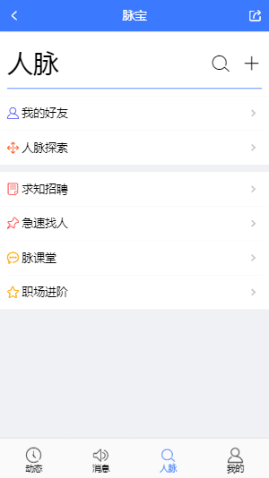

# maibao-app-h5

一个使用了基于vue2 + vuex + mintUI + less 构建的类似脉脉社交App应用。

本项目纯属个人学习研究之作，仅供学习和参考。

持续更新，有兴趣请star一下

## 开发资料

应用结构：http://naotu.baidu.com/file/8ff5335a1194fa6b2aca83385ccb813f?token=899775ee6bfad483

产品稿：https://org.modao.cc/app/d3d667bdb2e8a6cdf6383dd0411e77d7341265ae

## 安装

#### 注意：由于涉及大量的 ES6/7 等新属性，node 需要 6.0 以上版本 
```

git clone https://github.com/yzsunlei/maibao-app-h5.git

cd maibao-app-h5

//这里使用淘宝镜像安装能快一点
npm --registry https://registry.npm.taobao.org install

```
## 运行

### 本地调试模式

```
npm start

```
### 生产模式(部署)

```
npm run build

```

# 项目部分截图





# 当前实现的功能

>>动态模块
- [√] 好友动态列表
- [√] 关注动态列表
- [√] 职场动态列表
- [√] 动态详情
- [√] 动态发布

>>消息模块
- [√] 消息列表
- [x] 消息详情
- [x] 消息对话

>>人脉模块
- [√] 人脉首页
- [√] 好友列表
- [√] 好友通讯录
- [√] 人脉探索
- [√] 人脉-主题搜索
- [√] 人脉-探索发现
- [√] 人脉-附近的人

>>用户模块
- [√] 用户登录
- [√] 用户注册
- [√] 用户中心
- [√] 个人首页
- [√] 人脉二维码
- [x] 设置中心
- [x] 找回密码

## 相关使用技术链接

- [Vue](https://github.com/vuejs/vue)
- [mintUi](https://github.com/ElemeFE/mint-ui)
- [Vuex](https://github.com/vuejs/vuex)
- [webpack](https://github.com/webpack/webpack)
